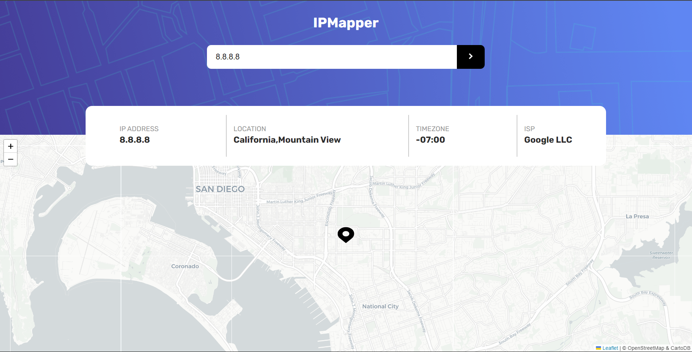
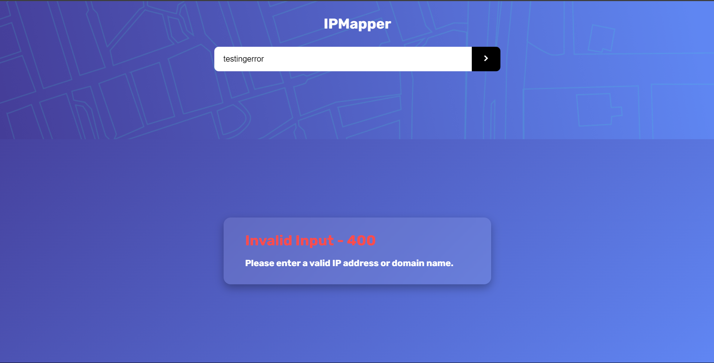

# 🌍 IPMapper
**Live Demo**: [ipmapper.netlify.app](https://ipmapper.netlify.app)

**IPMapper** is a frontend web application that allows users to locate the geographical position of an IP address or domain name on an interactive map. On initial load, it automatically detects and displays the user’s own IP location. The app is built using **React**, **LeafletJS**, and the **IPify Geolocation API**, and styled with modern **HTML**, **CSS**, and **JavaScript** best practices.

---

## 🚀 Features

- 🔎 **Search by IP or Domain**  
  Enter any valid IP address or domain name to view its geolocation.

- 🗺️ **Interactive Map**  
  Displays results on a map using **LeafletJS** with **CartoDB Positron tiles** for clean visuals.

- 🌐 **Auto-Locate User on Load**  
  Automatically fetches and displays the current user’s public IP location on app launch.

- 📱 **Responsive Design**  
  Fully mobile-friendly layout for a great experience on all devices.

- ❌ **Robust Error Handling**  
  Gracefully handles invalid input, API limits, network errors, and more — with user-friendly messages.

- ✨ **Modern Front-End Stack**  
  Built with React functional components and hooks for maintainability and performance.

---

## 🧪 Tech Stack

- **React** (JavaScript framework)
- **LeafletJS** (interactive map rendering)
- **CartoDB** (map tile provider)
- **IPify Geolocation API** (IP & domain geolocation)
- **Google DNS over HTTPS API** (used to resolve domain names to IP addresses)
- **HTML5**, **CSS3**, **JavaScript (ES6+)**

---

## 📸 Screenshots






---
## ⚠️ Notes
The app uses the IPify Geolocation API to retrieve location data based on IP addresses. For domain name searches, it first resolves the domain to an IP address using the Google DNS over HTTPS API, then fetches its geolocation.

A valid API key is required.

Free-tier keys have usage limits. If the app shows a message like “Free API usage limit reached”, it means the quota has been exhausted.

Location accuracy may vary depending on IP address and provider.

## 🔧 Setup & Installation

1. **Clone the repo**
   ```bash
   git clone [https://github.com/yourusername/ipmapper.git](https://github.com/DagiH22/IPMapper.git)
   cd ipmapper
   ```
2. **Install dependencies**
   ```bash
    npm install
   ```
3. **Add your IPify API Key**
    Create a .env file in the root directory:
    VITE_IP_API_KEY=your_api_key_here
4. **Start the development server**
   ```bash
     npm run dev
   ```
5. **Open in browser at http://localhost:5173 (or whatever Vite shows).**

   
Made with 💻, 🗺️, and ☕ by [Dagmawi](https://github.com/DagiH22)
   
